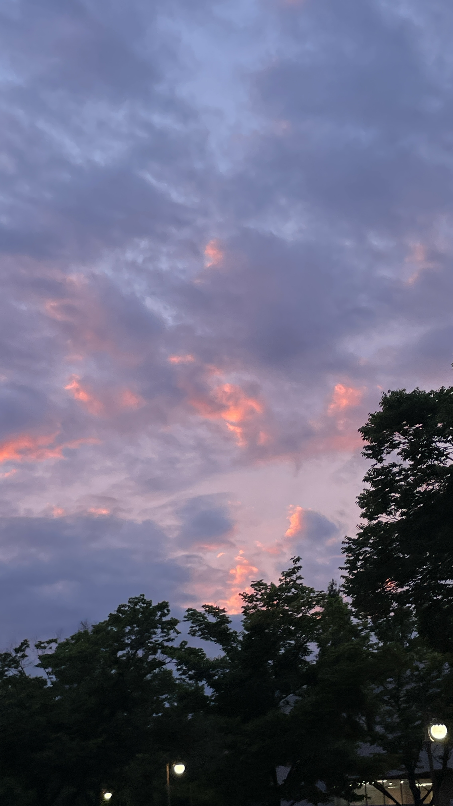

<h2 align='center'>Lakshmanan Meiyappan @ Laxmena</h2>

<b>Graduate Student at University of Illinois at Chicago</b>

<h2>Hey! 👋</h2>

<!-- 
 
-->

I'm Junhee Kwon! 
- <i>Currently:</i> Master Computer Science Student at SungKyunKwan University
- <i>Previously:</i> Bachelor student in Computer Science and Public Administaration major at SungKyunKwan University

<h2>💻 I'm Currently workng on</h2>

- Vehicle to Everything (V2X) Communication for Connected Vehicles
- Path Finding algorithm in Vehicle Navigation with Machine Learning

<!--  __Check out my GitHub repository:__

  

    
    
  

-->
<h2> About June⚡:</h2>

I'm a Graduate Student living in South Korea. 
Outside Tech, I love to read, enjoy music and explore nature outdoors.

 <!--
- Check out my Blog: [https://laxmena.com](https://laxmena.com)
- Know more about me: [About Laxmena](https://laxmena.com/pages/about)
- Write to me: [junenotjuly_@kakao.com](mailto:ConnectWith@laxmena.com)
-->

<h2>📫 How to reach me:</h2>

<!--
 

 -->